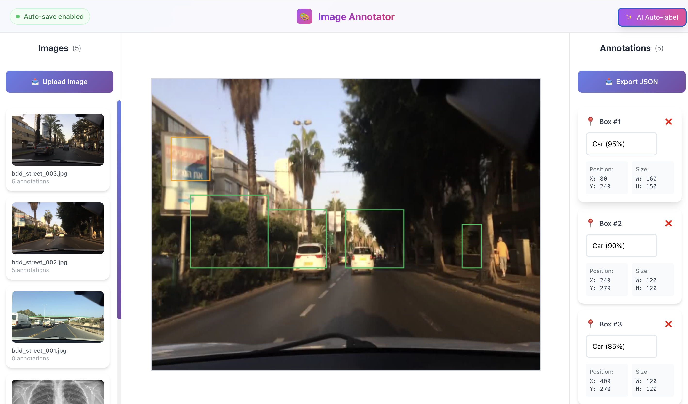
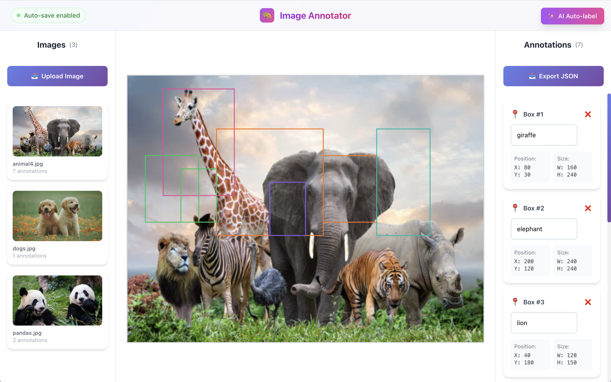
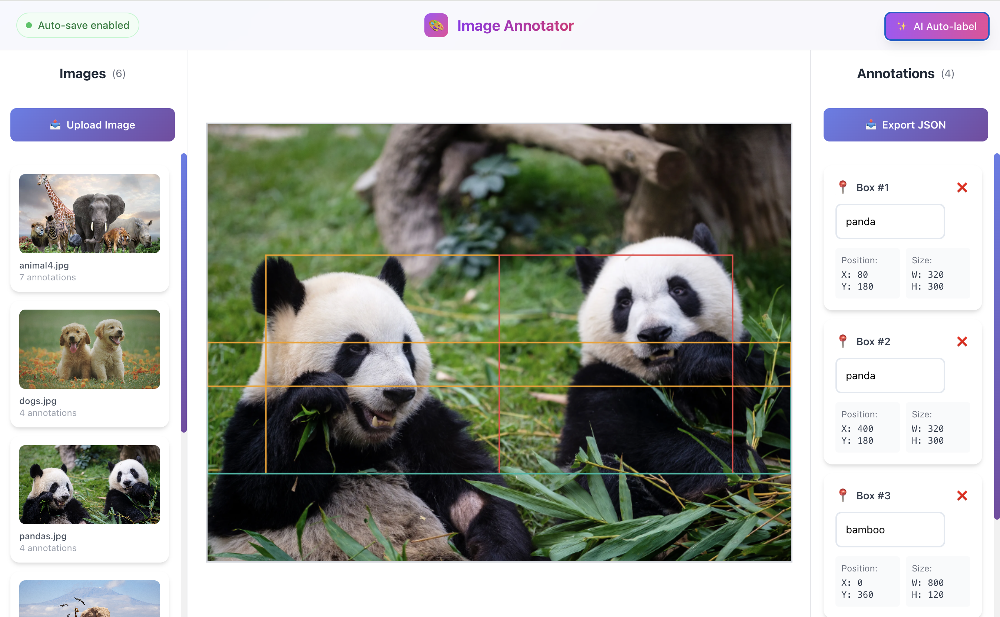
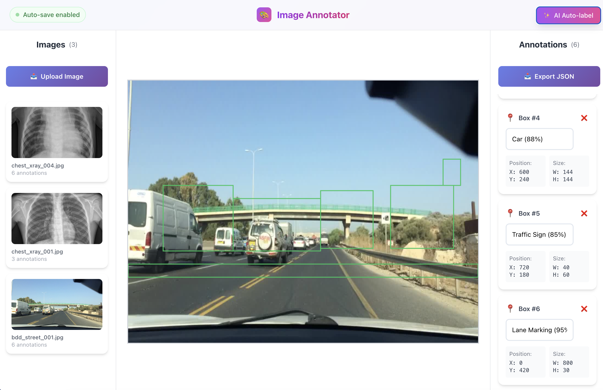
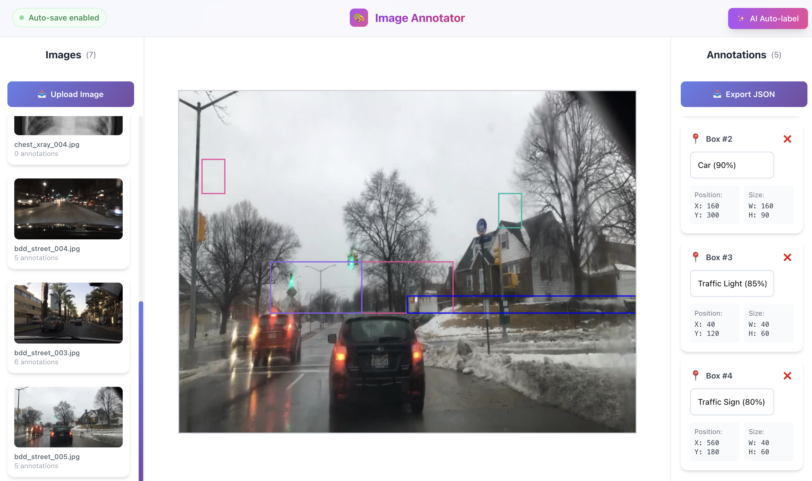
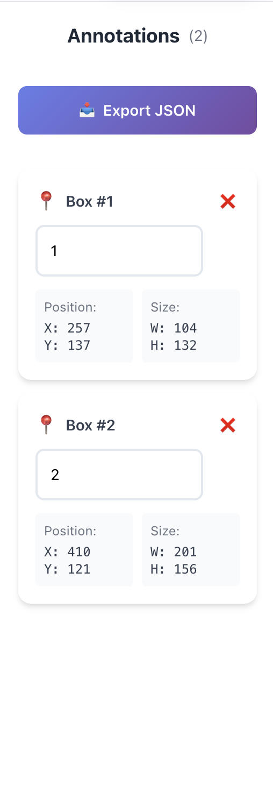
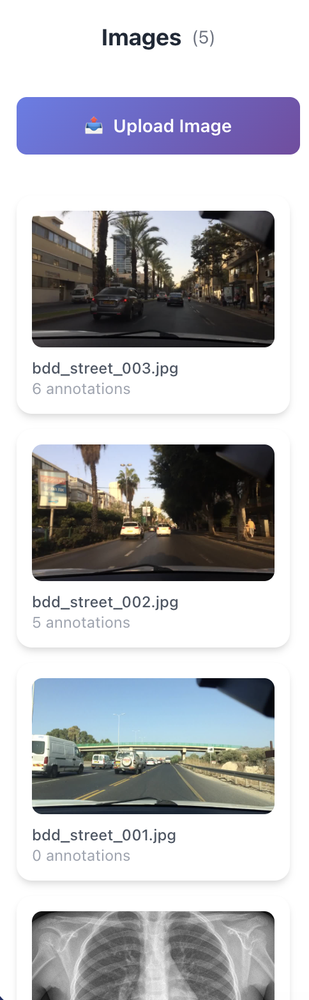
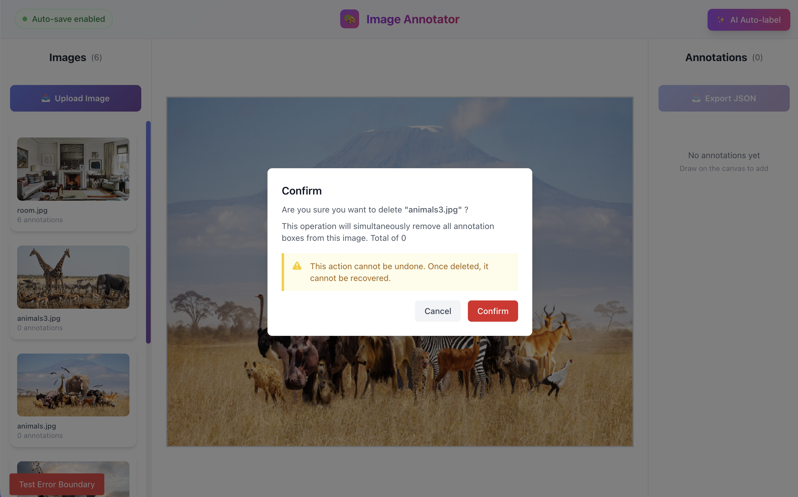
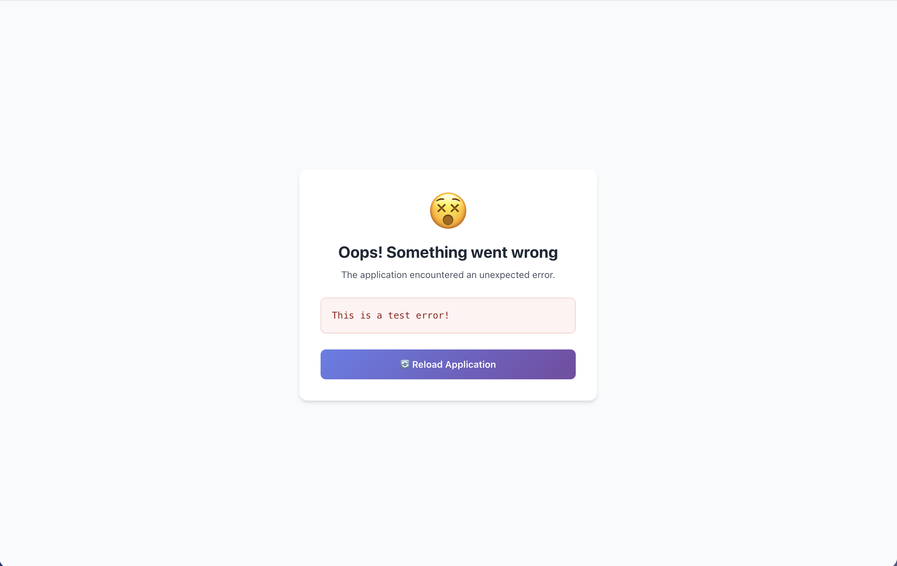
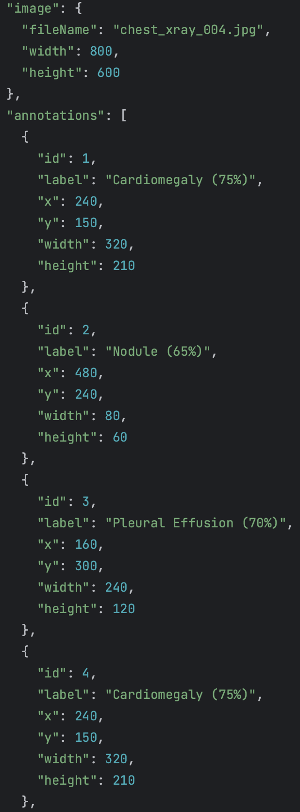

# 🎨 Image Annotator

A full-stack image annotation tool with AI-powered auto-labeling, real-time collaboration, and conflict detection. Built with React, Node.js, PostgreSQL, Redis, and OpenAI Vision API.

[](https://image-annotator-theta.vercel.app)
[](https://image-annotator-backend.onrender.com)
[](LICENSE)



> **Note:** Backend is deployed on Render's free tier and may take 30-60 seconds to wake up on first request.

---

## ✨ Features

### 🎯 Core Annotation Tools

- **Multi-Image Management** - Upload and manage multiple images with independent annotation data
- **Precise Bounding Boxes** - Draw accurate annotation boxes with mouse interactions
- **Smart Labeling** - Add, edit, and delete labels for each annotation
- **Undo/Redo** - Per-image history tracking with keyboard shortcuts (Cmd/Ctrl+Z)
- **Auto-Save** - Annotations automatically sync to backend database
- **JSON Export** - Export annotations in COCO format

### 🤖 AI-Powered Features

- **Domain-Specific AI Auto-Labeling** - Separate prompt pipelines for medical imaging and autonomous driving scenes using GPT-4 Vision API
- **Confidence-Coded Annotations** - Color-coded bounding boxes by confidence score: green ≥80%, yellow 50–80%, red <50%
- **Human-in-the-Loop Design** - AI generates draft annotations; users review and correct low-confidence regions
- **Auto Domain Detection** - Automatically selects the appropriate prompt based on image filename

### 🔴 Real-Time Collaboration

- **WebSocket Sync** - Multiple users can annotate the same dataset simultaneously with live updates
- **Redis Pub/Sub Broadcast** - Annotation changes are broadcast to all users viewing the same image with <200ms latency
- **Presence Awareness** - Toast notifications when another user updates annotations
- **Auto-Reconnect** - WebSocket automatically reconnects on disconnect

### 🔒 Conflict Detection

- **Optimistic Locking** - Version-based conflict detection on annotation updates
- **Concurrent Edit Protection** - Returns 409 if another user modified the same annotation first
- **Non-blocking** - Users are never blocked from editing; conflicts are detected at commit time

### 🎨 User Experience

- **Modern UI** - Glass-morphism design with purple gradient theme
- **Responsive Layout** - Three-panel interface optimized for workflow
- **Real-time Feedback** - Toast notifications for all operations
- **Error Handling** - Error boundary with graceful fallbacks
- **Performance Optimized** - React.memo for efficient rendering

---

## 🚀 Live Demo

**Try it now:** [https://image-annotator-theta.vercel.app](https://image-annotator-theta.vercel.app)

**API Documentation:** [https://image-annotator-backend.onrender.com/health](https://image-annotator-backend.onrender.com/health)

---

## 📸 Screenshots

### Main Interface


_Three-panel workspace: image list (left), annotation canvas (center), annotation management (right)_

### AI Auto-Labeling


_Pneumonia chest X-ray: AI detected Cardiomegaly (75%), Pleural Effusion (70%), and Nodule (65%). Color-coded by confidence — green ≥80%, yellow 50–80%, red <50%._


_Normal chest X-ray: AI flagged several low-confidence regions that don't correspond to real pathology — highlighting why **human-in-the-loop review is essential**. The platform is designed for AI to generate a draft, with radiologists confirming or dismissing each annotation._



_Autonomous driving scene: AI identified Cars, Trucks, Traffic Signs, and Lane Markings with high confidence (85–95%). The platform uses domain-specific prompts — medical imaging prompts request abnormal regions with confidence scores, while autonomous driving prompts target vehicles, pedestrians, and road infrastructure._

### Annotation Management


_Edit labels, view coordinates, and manage all annotations_

### Multi-Image Support


_Switch between multiple images with independent annotation data_

### Delete Confirmation


_Confirmation dialog prevents accidental deletion of images and annotations_

### Error Handling


_Error boundary catches unexpected errors and provides graceful fallback UI_

### JSON Export


_Export annotations in COCO format for machine learning and data analysis_

---

## 🛠️ Tech Stack

### Frontend

| Technology      | Purpose          | Version |
| --------------- | ---------------- | ------- |
| React           | UI Framework     | 19.x    |
| TypeScript      | Type Safety      | 4.x     |
| Zustand         | State Management | 5.x     |
| Tailwind CSS    | Styling          | 3.x     |
| Canvas API      | Drawing          | Native  |
| WebSocket API   | Real-time Sync   | Native  |
| react-hot-toast | Notifications    | 2.x     |

### Backend

| Technology | Purpose             | Version |
| ---------- | ------------------- | ------- |
| Node.js    | Runtime             | 18.x    |
| Express    | Web Framework       | 4.x     |
| PostgreSQL | Database            | 15.x    |
| Redis      | Pub/Sub Broadcast   | 8.x     |
| ws         | WebSocket Server    | 8.x     |
| Multer     | File Upload         | 1.x     |
| Sharp      | Image Processing    | 0.33.x  |

### AI Integration

- **OpenAI API** - GPT-4 Vision (gpt-4o-mini) for object detection
- **Domain-Specific Prompts** - Separate prompt pipelines for medical imaging and autonomous driving
- **Base64 Encoding** - Image format conversion for API compatibility

### Deployment

- **Frontend:** Vercel (Free tier)
- **Backend:** Render (Free tier)
- **Database:** Render PostgreSQL (Free tier)

---

## 📦 Getting Started

### Prerequisites

- Node.js 16+
- PostgreSQL 12+
- Redis 6+
- npm or yarn

### Backend Setup

1. **Clone and navigate:**

```bash
git clone https://github.com/zackJin1224/Image-annotator.git
cd Image-annotator/backend
```

2. **Install dependencies:**

```bash
npm install
```

3. **Start Redis:**

```bash
redis-server &
```

4. **Create database:**

```bash
createdb jing
```

5. **Configure environment:**

```bash
cp .env.example .env
```

6. **Start server:**

```bash
npm start
```

Server runs at `http://localhost:5001`

### Frontend Setup

1. **Navigate and install:**

```bash
cd ../frontend
npm install
```

2. **Configure API endpoint:**

```bash
REACT_APP_API_BASE_URL=http://localhost:5001
```

3. **Start development server:**

```bash
npm start
```

Application runs at `http://localhost:3000`

---

## 🎮 Usage Guide

### Basic Workflow

1. **Upload Images**
   - Click "📤 Upload Image" button
   - Select one or multiple images
   - Images appear in left sidebar

2. **Create Annotations**
   - Click and drag on canvas to draw bounding box
   - Enter label in popup input
   - Press Enter to confirm, Escape to cancel

3. **Manage Annotations**
   - View all annotations in right panel
   - Click label to edit
   - Click X to delete
   - Use Delete key to remove selected annotation

4. **Keyboard Shortcuts**

```
Cmd/Ctrl + Z          Undo
Cmd/Ctrl + Shift + Z  Redo
Delete/Backspace      Delete selected annotation
Escape                Cancel current action
Enter                 Confirm label input
```

5. **AI Auto-Labeling** (Optional)
   - Name your image with keywords like `chest_xray`, `skin_lesion`, `kitti_driving`, or `bdd_street` for automatic domain detection
   - Click "✨ AI Auto-label" button
   - Wait 5-10 seconds for processing
   - AI automatically detects objects and creates color-coded annotations

6. **Real-Time Collaboration**
   - Open the same image in multiple browser tabs or windows
   - Annotations sync in real time across all connected users
   - Toast notification appears when another user updates annotations

7. **Export Data**
   - Click "📥 Export JSON" button
   - Downloads COCO-format annotation file

### Tips & Tricks

- Annotations auto-save after each change
- Each image maintains independent annotation history
- Refresh page to verify data persistence
- Click image thumbnail to quickly switch between images

---

## 🏗️ Architecture

### Database Schema

```sql
CREATE TABLE images (
    id UUID PRIMARY KEY DEFAULT gen_random_uuid(),
    file_name VARCHAR(255) NOT NULL,
    file_path VARCHAR(500) NOT NULL,
    file_size INTEGER,
    width INTEGER,
    height INTEGER,
    created_at TIMESTAMP DEFAULT CURRENT_TIMESTAMP,
    updated_at TIMESTAMP DEFAULT CURRENT_TIMESTAMP
);

CREATE TABLE annotations (
    id UUID PRIMARY KEY DEFAULT gen_random_uuid(),
    image_id UUID REFERENCES images(id) ON DELETE CASCADE,
    start_x FLOAT NOT NULL,
    start_y FLOAT NOT NULL,
    end_x FLOAT NOT NULL,
    end_y FLOAT NOT NULL,
    label VARCHAR(100) NOT NULL,
    version INTEGER NOT NULL DEFAULT 1,
    created_at TIMESTAMP DEFAULT CURRENT_TIMESTAMP,
    updated_at TIMESTAMP DEFAULT CURRENT_TIMESTAMP
);

CREATE INDEX idx_annotations_image_id ON annotations(image_id);
CREATE INDEX idx_images_created_at ON images(created_at);
```

### API Endpoints

#### Images

```
GET    /api/images           - List all images
GET    /api/images/:id       - Get image with annotations
POST   /api/images           - Upload new image
DELETE /api/images/:id       - Delete image (cascade)
```

#### Annotations

```
GET    /api/images/:imageId/annotations          - Get image annotations
POST   /api/images/:imageId/annotations          - Create annotation
PUT    /api/images/:imageId/annotations          - Replace all annotations (broadcasts via Redis)
PUT    /api/annotations/:id                      - Update annotation (Optimistic Locking)
DELETE /api/annotations/:id                      - Delete annotation
```

### Real-Time Architecture

```
User A draws box → PUT /api/images/:id/annotations
                 → Redis PUBLISH annotation-updates
                 → Redis subscriber receives message
                 → WebSocket broadcast to all clients on same imageId
                 → User B receives update, UI re-renders
```

**Measured broadcast latency: ~2ms** (local network, Redis + WebSocket pipeline)

### State Management

```typescript
interface AnnotationStore {
  images: ImageData[];
  currentImageIndex: number;
  imageHistories: Map<string, History>;
  ws: WebSocket | null;
  clientId: string | null;

  loadImages: () => Promise<void>;
  addImage: (file: File) => Promise<void>;
  selectImage: (index: number) => void;
  deleteImage: (index: number) => Promise<void>;
  setAnnotations: (boxes: Box[]) => void;
  saveAnnotations: () => Promise<void>;
  undo: () => void;
  redo: () => void;
  initWebSocket: () => void;
  joinImageChannel: (imageId: string) => void;
}
```

---

## 🤖 AI Integration

### Domain-Specific Prompts

The platform uses separate prompt pipelines depending on the image type:

**Medical Imaging** (chest X-rays, fundus photos, skin lesions):
- Requests abnormal regions with bounding boxes and confidence scores
- Labels include: Cardiomegaly, Pleural Effusion, Nodule, Skin Lesion, Optic Disc
- Confidence scores drive color-coding to highlight regions needing human review

**Autonomous Driving** (street scenes, KITTI, BDD100K):
- Targets vehicles, vulnerable road users, and road infrastructure
- Labels include: Car, Truck, Pedestrian, Traffic Light, Lane Marking
- Optimized for detecting all objects in a scene including partial occlusions

**Auto Detection:**
```typescript
detectDomain(fileName: string): ImageDomain {
  if (fileName.includes("xray") || fileName.includes("chest")) return "medical";
  if (fileName.includes("kitti") || fileName.includes("driving")) return "autonomous_driving";
  return "general";
}
```

### Prompt Evaluation (IoU Benchmark)

Evaluated on 5 manually annotated ground truth boxes from a BDD100K street scene:

| Metric                  | Domain-Specific | General |
| ----------------------- | --------------- | ------- |
| Match Rate (IoU ≥ 0.3)  | 20.0%           | 20.0%   |
| Average IoU             | 0.142           | 0.153   |
| Detections              | 5               | 6       |

While bounding box localization accuracy is similar across both prompts, domain-specific prompts produce semantically correct labels for the driving context (e.g., "Traffic Sign" vs. "tree" for the same region). Results confirm that GPT-4 Vision is best suited for draft annotation, validating the human-in-the-loop design.

### Confidence Color Coding

```
Green  (#22c55e)  confidence ≥ 80%  — high confidence, likely correct
Yellow (#f59e0b)  confidence 50–79% — medium confidence, review recommended
Red    (#ef4444)  confidence < 50%  — low confidence, human review required
```

### Cost Analysis

- Model: gpt-4o-mini
- Cost: ~$0.001 per image (0.1 cents)
- $5 credit = ~5000 image analyses

---

## 🔴 Real-Time Collaboration

### How It Works

1. Client connects via WebSocket on page load
2. Client joins the current image's channel (`{ type: "join", imageId }`)
3. On every save, backend publishes to Redis `annotation-updates` channel
4. Redis subscriber broadcasts to all WebSocket clients on the same imageId
5. Each client filters out its own updates using a unique `clientId`

### Conflict Detection (Optimistic Locking)

Each annotation has a `version` field in the database. On update:

1. Backend reads current version
2. If submitted version doesn't match → return `409 Conflict`
3. If versions match → update and increment version
4. Frontend catches 409 and shows conflict toast to user

```
User A reads annotation (version=1)
User B reads annotation (version=1)
User A updates → version becomes 2
User B updates with version=1 → 409 Conflict returned
```

---

## 🚀 Deployment

### Backend (Render)

1. Create PostgreSQL Database on Render free tier
2. Create Web Service connected to GitHub repository
3. Set environment variables:

```env
DATABASE_URL=your_postgres_url
NODE_ENV=production
```

> **Note:** Redis Pub/Sub and WebSocket collaboration features require a Redis instance and are currently active in local development only.

### Frontend (Vercel)

1. Import project from GitHub, framework: Create React App
2. Root directory: `frontend`
3. Set environment variables:

```env
REACT_APP_API_BASE_URL=https://your-backend.onrender.com
```

---

## 🐛 Troubleshooting

**Database connection failed** — Verify `DATABASE_URL` in environment variables

**Redis connection refused** — Run `redis-server &` before starting the backend

**WebSocket not connecting** — Ensure backend is running and check browser console for errors

**CORS errors** — Check allowed origins in `server.js`

**Annotations disappearing** — Ensure auto-save is working (check browser console)

---

## 🎯 Future Enhancements

- [ ] User authentication (JWT)
- [ ] Polygon and polyline annotations
- [ ] Advanced export formats (YOLO, Pascal VOC)
- [ ] Evaluation pipeline: IoU scoring against ground truth datasets (KITTI, NIH)
- [ ] Annotation statistics dashboard
- [ ] Docker containerization
- [ ] Unit and E2E tests

---

## 📊 Project Metrics

| Metric           | Value                       |
| ---------------- | --------------------------- |
| Development Time | ~25 days                    |
| Lines of Code    | ~1,800 (excluding comments) |
| Components       | 5                           |
| API Endpoints    | 9                           |
| Database Tables  | 2                           |
| Git Commits      | 30+                         |

---

## 👨‍💻 Author

**Zijing Jin**

- 🎓 MS in Information Science @ University of Pittsburgh
- 💼 [LinkedIn](https://www.linkedin.com/in/zijing-jin1224)
- 🐙 [GitHub](https://github.com/zackJin1224)
- 📧 Email: zachjin1224@gmail.com

---

## 🙏 Acknowledgments

- [OpenAI](https://openai.com/) for GPT-4 Vision API
- [Render](https://render.com/) for backend hosting
- [Vercel](https://vercel.com/) for frontend hosting
- [Redis](https://redis.io/) for Pub/Sub infrastructure
